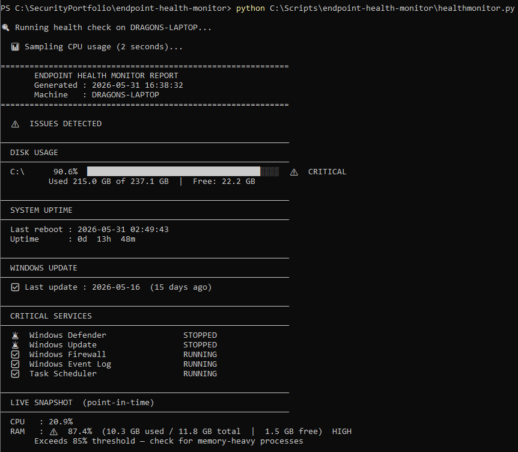
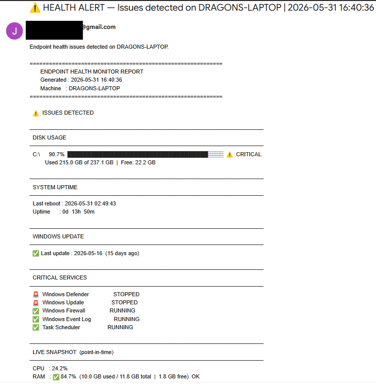
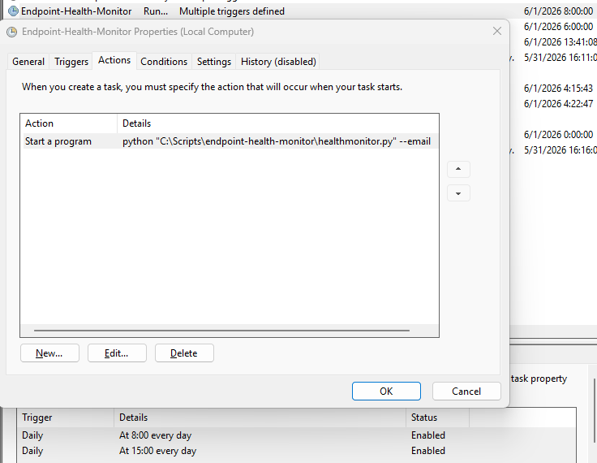

# Endpoint Health Monitor

A Python automation tool that runs twice daily on Windows endpoints,
checks disk usage, system uptime, Windows Update status, critical
services, and live RAM and CPU metrics — and sends an automated Gmail
alert when anything crosses a configured threshold.

Built for practical IT support and MSP-style endpoint monitoring.
No manual checks. No noise when everything's healthy.

---

## The Problem This Solves

Disk drives fill up quietly. Services stop without warning. Windows
Update falls behind. RAM creeps toward capacity during a long session.
None of these announce themselves — you find out when something breaks.

This tool checks for all of it automatically, twice a day, and only
speaks up when something actually needs attention.

---

## What It Monitors

- **Disk usage** — all volumes, flags when usage exceeds threshold
- **System uptime** — time since last reboot with full timestamp
- **Windows Update** — days since last installed update, flags if
  overdue
- **Critical services** — verifies Windows Firewall, Event Log,
  Task Scheduler, Defender, and Windows Update are running
- **Live RAM snapshot** — current usage, flags if above threshold
- **Live CPU snapshot** — current usage at time of run

Runs at **8 AM and 3 PM daily** via Windows Task Scheduler.
Sends a **Gmail SMTP alert** only when something is flagged —
clean runs produce no output and no email.

---

## Screenshots

### Terminal Output


### Email Alert


### Task Scheduler


---

## Project Structure

```
endpoint-health-monitor/
├── healthmonitor.py       # Core logic: checks, report, alert
├── requirements.txt       # psutil — the only dependency
├── .gitignore             # Blocks generated reports and credentials
├── SAMPLE_REPORT.txt      # Sanitized example output
├── screenshots/           # Proof of execution
└── docs/
└── setup_guide.md     # Setup, scheduling, and CLI reference

```
---

## Quick Start

**1. Install the dependency**
```powershell
pip install psutil
```

**2. Set email credentials**

Uses the same three Windows environment variables as the
[Windows Security Log Analyzer](https://github.com/PattonJL/windows-security-log-analyzer):
`ALERT_EMAIL_SENDER`, `ALERT_EMAIL_PASSWORD`, `ALERT_EMAIL_RECEIVER`.

If that project is already deployed, no new credential setup is needed.
See `docs/setup_guide.md` for first-time setup.

**3. Run it**
```powershell
python healthmonitor.py --email
```

**4. Schedule it**

See `docs/setup_guide.md` → Step 4 for full Task Scheduler setup.

---

## CLI Options

```powershell
python healthmonitor.py [--threshold N] [--ram-threshold N] [--update-days N] [--email]
```

| Flag | Default | Description |
|---|---|---|
| `--threshold N` | `85` | Disk % before flagging critical |
| `--ram-threshold N` | `85` | RAM % before flagging high |
| `--update-days N` | `30` | Days since last update before flagging |
| `--email` | off | Send alert if any issues detected |

`--email` only sends when something is actually flagged.
A clean run stays completely silent.

---

## Security Design

**One dependency, fully auditable.** The only third-party library
is `psutil` — a widely used, well-maintained system metrics library.
Everything else is Python standard library.

**Credentials never in the codebase.** Gmail credentials load from
Windows environment variables set once at the system level.
`.gitignore` blocks any credential files from version control.

**No real endpoint data committed.** Generated reports follow the
pattern `health_report_*.txt` and are blocked by `.gitignore`.
`SAMPLE_REPORT.txt` contains entirely fictional machine data.

**Silent when healthy.** The scheduled task runs twice daily but
only generates network traffic when something needs attention.
No alert fatigue from routine runs.

---

## MSP Relevance

This tool mirrors the endpoint monitoring workflows used in
managed service provider environments:

| This Tool | MSP Equivalent |
|---|---|
| Disk threshold alerts | Storage capacity monitoring |
| Service status checks | Service health polling |
| Windows Update tracking | Patch compliance reporting |
| RAM and CPU snapshots | Performance baseline checks |
| Twice-daily scheduled runs | Continuous endpoint monitoring |
| Email alert delivery | Technician notification pipeline |

---

## Part of a Growing Security Automation Suite

This project is part of a personal suite of Windows security and
IT automation tools:

- **[Windows Security Log Analyzer](https://github.com/PattonJL/windows-security-log-analyzer)**
  — Brute force detection via Event ID 4625 with automated alerting
- **Endpoint Health Monitor** ← you are here

---

## Author

**Justin Patton**

CompTIA Security+ · Google Cybersecurity · Google IT Support

[LinkedIn](https://www.linkedin.com/in/pattonjl/) ·
[GitHub](https://github.com/PattonJL)